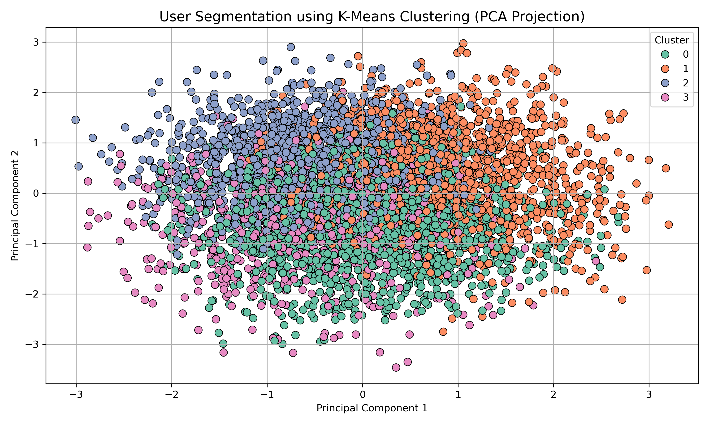
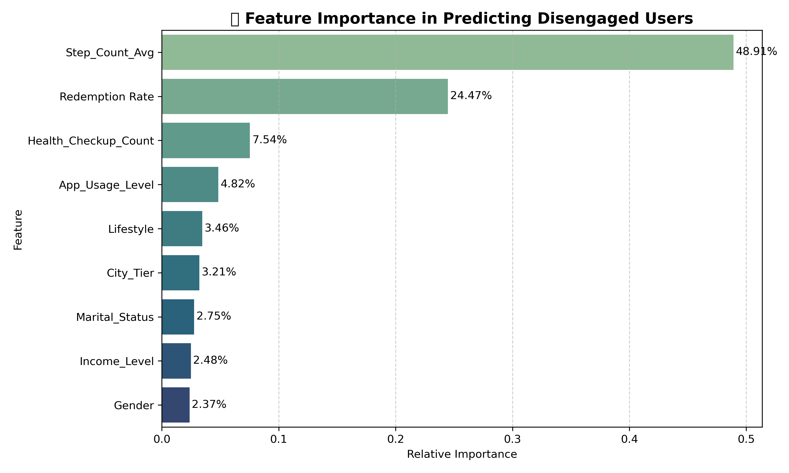

# Engagement Analytics in Health Insurance  
### A Retention Decision System for Predicting Disengagement and Targeting Cost-Effective Interventions  

[](https://www.linkedin.com/in/damo-madhukar)  
[](https://github.com/damo97-dsi/engagement-analytics-insurance)

---

## 🚀 Executive Snapshot

- 🎯 Identifies high-risk disengaged customers for targeted retention  
- 📊 ~87% model accuracy with clear risk prioritization  
- 💰 Estimated 15% churn reduction (~$1.2M impact)  
- 🧠 Behavioral segmentation into 3 actionable personas  
- ⚡ Highlights effectiveness of low-cost, non-monetary incentives  

---

## 📊 Sample Output

  


---

This project builds a decision-driven analytics system to identify disengaged health insurance customers, segment them by behavioral risk, and guide targeted retention actions.# Engagement Analytics in Health Insurance
### A Retention Decision System for Predicting Disengagement and Targeting Cost-Effective Interventions

This project builds a decision-oriented analytics system to identify disengaged health insurance customers, segment them by behavioral risk, and recommend targeted retention actions.

Rather than stopping at churn prediction, the project translates model outputs into intervention tiers that help prioritize which customers to target, what type of incentive to use, and where retention spend is likely to generate the highest value.

---

## Business Problem

Health insurers often lose customers not only because of price or claims issues, but because of declining engagement in wellness and loyalty programs.  
When disengagement is detected too late, retention efforts become expensive and less effective.

This project addresses three business questions:

- Which customers are at risk of disengaging?
- What behavioral segments exist within the disengaged population?
- Which intervention strategy is likely to improve retention at the lowest cost?

---

## Objective

The goal of this project is to design a retention decision system that:

- predicts disengagement risk,
- identifies actionable customer segments,
- and supports targeted intervention planning for retention teams.

---

## Decision Framework

Customers are scored based on disengagement risk and grouped into action tiers:

- **High Risk**: Immediate intervention with targeted incentive or personalized engagement
- **Medium Risk**: Behavioral nudges, reminders, and lower-cost follow-up actions
- **Low Risk**: Passive monitoring

This framework helps shift retention from broad, expensive outreach to focused, risk-based decision making.

---

## Dataset

This project uses a simulated health insurance customer engagement dataset designed to reflect real-world behavioral signals such as:

- inactivity streaks,
- rewards usage,
- wellness engagement,
- digital interaction patterns,
- and demographic characteristics.

The simulated design allows testing of realistic customer retention logic while preserving privacy.

---

## Methodology

### 1. Data Preparation
- cleaned and validated engagement data
- engineered behavioral features linked to disengagement risk
- prepared variables for modeling and segmentation

### 2. Predictive Modeling
Built machine learning models to predict disengagement risk, including:

- Logistic Regression
- Random Forest

The final modeling approach achieved strong classification performance and helped prioritize high-risk customers for intervention planning.

### 3. Behavioral Segmentation
Cluster analysis was used to identify meaningful customer personas based on engagement behavior and incentive responsiveness.

### 4. Retention Strategy Design
Model outputs and segmentation results were translated into a practical intervention framework aligned to likely business actions.

---

## Key Results

- **Predicted disengagement risk with ~87% model accuracy**
- **Estimated potential churn reduction of 15% through targeted intervention**
- **Projected annual retention value of up to $1.2M**
- **Identified 3 actionable customer personas for retention targeting**
- **Found that younger customer cohorts responded better to non-monetary and gamified incentives**

---

## Business Insights

Key findings from the analysis include:

- disengaged customers often showed a combination of inactivity streaks and reward fatigue
- broad incentive strategies are less efficient than targeted outreach to high-risk segments
- non-monetary interventions can be effective for specific cohorts, improving retention while lowering incentive cost
- segmentation improves prioritization by distinguishing who needs direct intervention versus lighter engagement nudges

---

## Visual Outputs

The project includes the following visual analyses:

- **Cluster Segmentation** (`cluster_segmentation.png`)
- **Feature Correlation Matrix** (`correlation_matrix.png`)
- **Random Forest Feature Importance** (`feature_importance_rf.png`)

---

## Tools & Technologies

- **Python**
- **pandas**
- **scikit-learn**
- **matplotlib**
- **Power BI**
- **Jupyter Notebook**

---

## Project Structure

```text
engagement-analytics-insurance/
│
├── data/
├── notebooks/
├── visuals/
├── report/
├── README.md
├── requirements.txt
└── LICENSE
